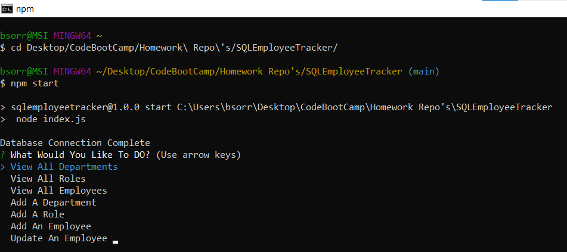

# SQLEmployeeTracker

## Table of Contents
* [Description](#description)
* [Installation](#installation)
* [Usage](#usage)
  * [License](#license) 
* [Contributing](#contributing)
* [Tests](#tests)
* [Questions](#questions)

----

## Description
This project was assigned as prt of the GTPE Coding Bootcamp to create CLI tool for manging employees using Javascript, Node,Inquirer, and MYSQL

----

## Installation
This project requires the installation of node. Clone the repository and enter the credentials for your MYSQL server into the indicated space on lines 12 and 13 of index.js. Be sure to run the schema.sql and seeds.sql in order to generate and prepopulate the database.

----

## Usage
To use this command line tool, 
* run "npm install" to install the required dependencies
* run "npm start" to initiate the program.  

[Example Video](https://watch.screencastify.com/v/cSpAfPCxhqyCSZza0H5V)

This README was generated using this project, with the exception of the added photos and video.

[Go To Live Project](https://berlicthehunter.github.io/SQLEmployeeTracker/)

## License
This project is licensed under MIT License and can be found [here](./LICENSE)

----

## Contributing
This project is not accepting contributions at this time

----

## Tests
None provided

----

## Questions
For any other questions, please the the provided links below
* [Github](https://github.com/BerlicTheHunter)
* [Email](mailto:bsorrell3@gmail.com)
